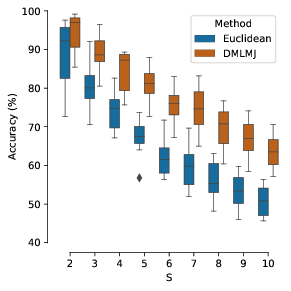
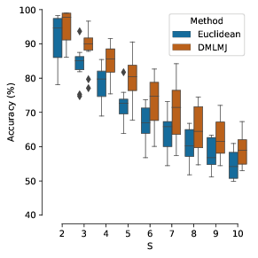
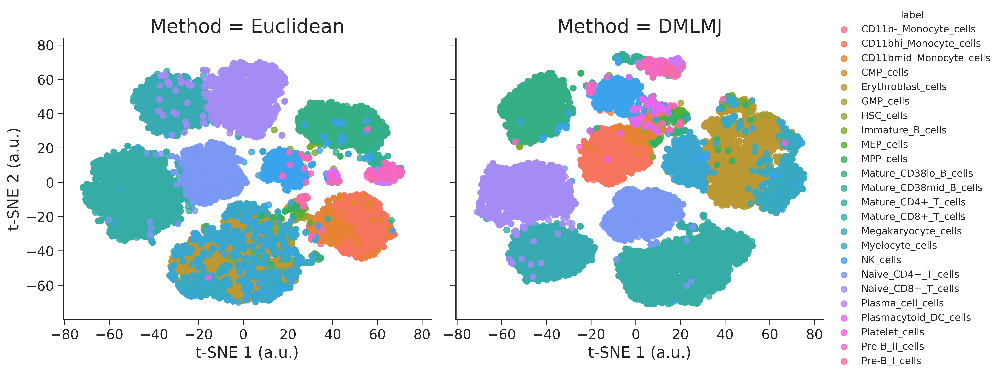
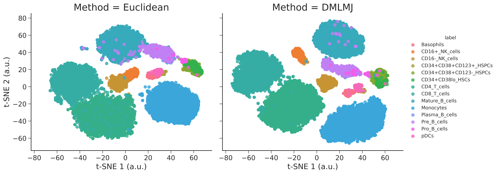
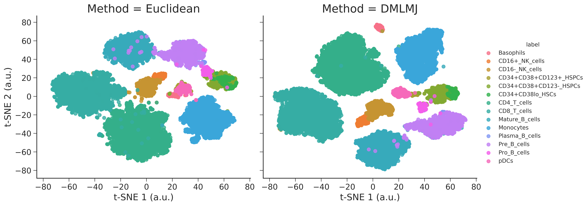

# Learning Single-Cell Distances from Cytometry Data
This repository accompanies the manscript "Learning Single-Cell Distances from Cytometry Data"** by B. Nguyen, P. Rubbens, F.-M. Kerckhof, N. Boon, B. De Baets and W. Waegeman. 

## ABSTRACT: 
Data analysis techniques for the automated identification of cell populations are witnessing an increased interest in the field of cytometry. These techniques commonly depend on a distance metric to measure similarities between single cells. In this study, we explore the use of distance metric learning to automatically determine a generalized form of the Euclidean distance metric, the so-called Mahalanobis distance metric. This approach can be used in cases where single-cell labels are available. We evaluate the potential of a learned distance metric in various ways. First, we show that current distance-based methods can be improved upon by implementing an appropriate Mahalanobis distance metric. Then, to evaluate the robustness of such a distance metric, we evaluate the transferability of a Mahalanobis distance metric between samples.  In addition, we show that a learned distance metric can be integrated with unsupervised methods, such as clustering or dimensionality reduction. In particular, the approach is illustrated for cytometry data from two different origins, i.e.\ flow cytometry applied to microbial cells and mass cytometry for the analysis of human blood cells. Results indicate that a learned distance metric improves cell population identification. It is a robust property of a specific cytometry setup, meaning that a learned distance metric can be transferred between samples. Therefore, it can provide a useful way to incorporate domain knowledge into a downstream multivariate analysis and address sources of variability to some extent. 

## Structure: 

<p align="center">
  
  
</p>

<p align="center">
  
</p>

<p align="center">
  
</p>

<p align="center">
  
</p>


### Prerequisites
DMLMJ has been tested using MATLAB 2010A and later on Windows and Linux (Mac should be fine).

## Data Accessibility
## Installation
Download the folder "DMLMJ" into the directory of your choice. Then within MATLAB go to file >> Set path... and add the directory containing "DMLMJ" to the list (if it isn't already). That's it.

## Usage
First we need to learn a linear transformation from supervised data
```matlab
params = struct();
params.kernel = 0;
params.knn = 5;
params.dim = 10;
>> L = DMLMJ(XTr, YTr, params)
```
### Parameters
* XTr: Training examples (d x n, where d is the number of features and n is the number of examples)
* YTr: Training labels   (n x 1)
* params (optional): 
   * .kernel (If set to 1, a kerned method is applied, default = 0)
   * .ker    (Kernel type: 'rbf' or 'poly' will be applied, default = 'rbf')
   * .knn    (Number of neighbors, default = 5)
   * .dim    (Desired number of dimensionality, default = cross-validation)

Once we have learned L, we can use it for unsupervised data
```matlab
>> X = L'*X;
```
## Authors

* [Bac Nguyen](https://github.com/bacnguyencong)
* [Peter Rubbens](https://github.com/prubbens)

## Acknowledgments
If you find this code useful in your research, please consider citing:
``` bibtex
@Article{Nguyen2016,
  Title       = {Supervised distance metric learning through maximization of the {J}effrey divergence},
  Author      = {Bac Nguyen and Carlos Morell and De Baets, Bernard},
  Journal     = {Pattern Recognition},
  Year        = {2017},
  Pages       = {215-225},
  Volume      = {64}
}
```
