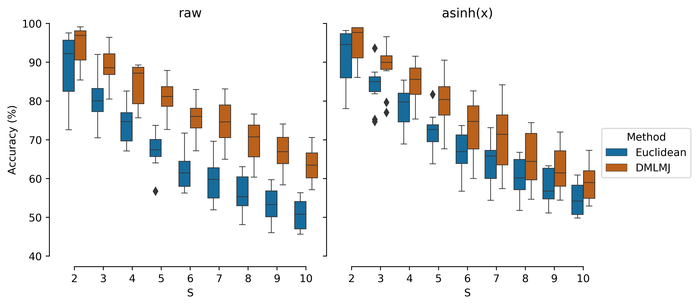
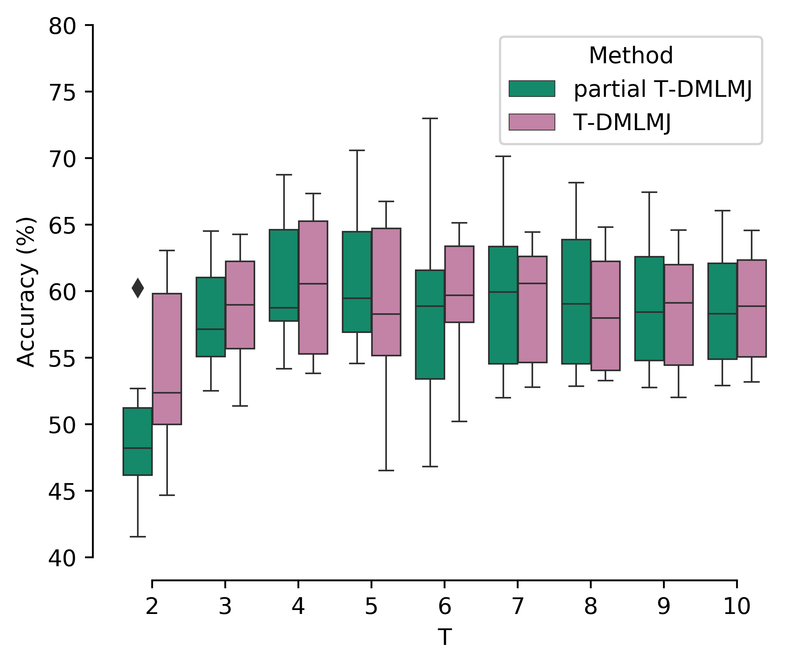

# Application 1: Synthetic microbial communities
## Dataset 1: In Silico Bacterial Communities
We will illustrate our approach with a reduced number of communities. This data can be found in the folder ``experiments/Application_1+Dataset_1/data/``. The full dataset was originally published in [1] and can be accessed via [FlowRepository (ID: FR-FCM-ZY6M)](https://flowrepository.org/experiments/1238). 
Results using the full dataset can be found in the folder ``experiments/Application_1+Dataset_1/output/``

### Example
Download the repository, open the Malab console, and within the console go to ``experiments/Application_1+Dataset_1/`` by
```matlab
cd experiments/Application_1+Dataset_1/
```
Next, run the following [demo](demo.m) script:
```matlab
% configure the paths
clear all
addpath(genpath('helpers'));
my_path = pwd;
cd ../..
addpath(genpath([pwd '/algorithms/']));
addpath(genpath([pwd '/helps/']));
cd(my_path);

%%%%%%%%%%%%%%%%%%%%%%%%%%%%%%%%%%%%%%%%%%%%%%%%%%%%%%%%%%%%%
populations = [5, 8, 12, 20];
% build training and test sets by joining populations
X_train = []; Y_train = [];
X_test = []; Y_test = [];
for p = populations,
    [XTr, YTr, XTe, YTe] = getCommunity(p);
    X_train = [X_train XTr];
    Y_train = [Y_train; YTr];
    X_test = [X_test XTe];
    Y_test = [Y_test; YTe];
end

% configure parameters for DMLMJ
params = struct();
params.dim = 10; % the desired number of features in the transformed space.
params.k1 = 5; % positive neighbors
params.k2 = 5; % negative neighbors

% learn a linear transformation using DMLMJ
L = DMLMJ(X_train, Y_train, params);

% Use k=3 to test the performance of knn and DMLMJ
% knn classification using Euclidean
E_Y_hat = knnClassifier(X_train, Y_train, 3, X_test);

% knn classification using DMLMJ
fprintf('Classification accuracies of k-nearest-neighbor using\n');
M_Y_hat = knnClassifier(L'*X_train,Y_train, 3, L'*X_test);
fprintf('1) Supervised settings:\n');
fprintf('Euclidean = %.2f\n', mean(E_Y_hat==Y_test)*100);
fprintf('DMLMJ = %.2f\n\n', mean(M_Y_hat==Y_test)*100);

% Transfer setting.
% Once the linear transformation L is learned,we can use it for other tasks as
% well, for which the source and target tasks are related and share some common structure.
target_populations = [23, 13];
X = []; Y = [];
X_te = []; Y_te = [];
for p = target_populations,
    [XTr, YTr, XTe, YTe] = getCommunity(p);
    X = [X XTr];
    Y = [Y; YTr];
    X_te = [X_te XTe];
    Y_te = [Y_te; YTe];
end

% Use k=3 to test the performance of knn and DMLMJ
% knn classification using Euclidean
E_Y_hat = knnClassifier(X, Y, 3, X_te);

% knn classification using DMLMJ
M_Y_hat = knnClassifier(L'*X, Y, 3, L'*X_te);
fprintf('2) Transfer settings:\n');
fprintf('Euclidean = %.2f\n', mean(E_Y_hat==Y_te)*100);
fprintf('DMLMJ = %.2f\n', mean(M_Y_hat==Y_te)*100);
```

This gives the following output (_results may vary depending on PC_): 
```
Classification accuracies of k-nearest-neighbor using
1) Supervised settings:
Euclidean = 66.37
DMLMJ = 84.00

2) Transfer settings:
Euclidean = 93.79
DMLMJ = 98.61
```

### Using the full dataset

First, download the dataset from FlowRepository, and transfer .fcs format to .csv. 

_Warning_: Running DMLMJ for all 90 communities is going to take a while...

##### 1. Using the full raw (=untransformed) dataset
Within the Malab console, run the following command
```matlab
runExps(0)
```
We report the accuracies of the `k`-NN classifier using the Euclidean and the Mahalanobis distances, respectively, in the folder ``output``. More specifically, the following files will be generated:

- ``supervised.txt``: This corresponds the supervised settings. Each row represents the results with respect to different values of the species richness ``S``, which is increased from 2 to 10.

- ``partialsupervised.txt``: This corresponds the partial transfer DMLMJ settings. DMLMJ was applied at every step using the community that was only partially present in
the target community (10 microbial populations). Each row represents the results with respect to different values of ``T`` (number of microbial populations that was used to perform DMLMJ), which is increased from 2 to 10.
- ``unsupervised.txt``: This corresponds the transfer DMLMJ settings. DMLMJ was applied using microbial populations of which none were part of the target communities. As the target communities contained ten bacterial populations, the remaining populations were used to determine the distance metric through DMLMJ for ``T`` from 2 to 10.

10 different communities were created for a different species richness to avoid the effect of randomness (in total 90 rows for each file).

##### 2. Using the full transformed dataset
The results of ``k``-NN classification on data transformed by ``f(x)=asinh(x)``. Within the Malab console, run the following command
```matlab
runExps(1)
```
In the folder ``output``, the following files will be generated
- ``asinh_supervised.txt``: This corresponds the supervised settings.
- ``asinh_partialsupervised.txt``: This corresponds the partial transfer DMLMJ settings.
- ``asinh_unsupervised.txt``: This corresponds the transfer DMLMJ settings.

All files have the same structure as in ``Experiments on the raw data``.

#### 3. Making figures
- The python script to make Fig. 1(a) can be found from [here](make_supervised_figure.py)
<p align="center">
  
</p>

- The python script to make Fig. 2(a) can be found from [here](make_transfer_figure.py)
<p align="center">
  
</p>

```bash
python python_script.py
```

### References
[1] [Rubbens, P., and Props, R. and Garcia-Timermans, C. and Boon, N. and Waegeman, W. "Stripping flow cytometry: How many detectors do we need for bacterial identification?" Cytometry Part A 91A: 1184--1191, 2017.](https://onlinelibrary.wiley.com/doi/abs/10.1002/cyto.a.23284)
